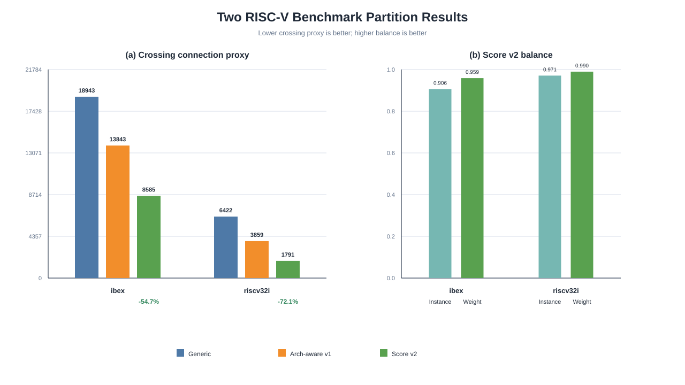

# RV3D-Public

Architecture-aware 2-tier partitioning prototype for RISC-V gate-level designs.

This project explores whether RISC-V architectural semantics can improve early-stage tier partitioning decisions. Instead of treating a gate-level netlist as an anonymous graph, the flow extracts lightweight structural features, classifies instances into architecture-related groups, and applies a balance-aware local refinement heuristic to reduce inter-tier crossing connections.

The current implementation is a research prototype, not a full 3D physical design tool.

## Highlights

- Complete public experimental pipeline for RISC-V gate-level partitioning.
- Two RISC-V benchmarks: Ibex and riscv32i.
- ORFS/OpenROAD clean baselines on sky130hd.
- Architecture-aware instance classification.
- FM-style local refinement with crossing, balance, and architecture terms.
- Benchmark summaries, ablation study, and SVG visualizations.

## Current Benchmarks

| Design | Platform | Instances | Route DRC Lines | Status |
| --- | --- | ---: | ---: | --- |
| Ibex | sky130hd | 15601 | 0 | clean baseline |
| riscv32i | sky130hd | 5737 | 0 | clean baseline |

## Main Results

| Design | Method | Crossing Proxy | Reduction vs Generic | Instance Balance | Weight Balance |
| --- | --- | ---: | ---: | ---: | ---: |
| Ibex | Generic balance | 18943 | 0.0% | 0.999872 | 0.999946 |
| Ibex | Architecture-aware v1 | 13843 | 26.9% | 0.821483 | 0.999946 |
| Ibex | Architecture-score v2 | 8585 | 54.7% | 0.906281 | 0.958692 |
| riscv32i | Generic balance | 6422 | 0.0% | 0.999651 | 0.999859 |
| riscv32i | Architecture-aware v1 | 3859 | 39.9% | 0.543449 | 0.613791 |
| riscv32i | Architecture-score v2 | 1791 | 72.1% | 0.970800 | 0.989585 |



## Method

The flow contains five stages:

1. Run ORFS/OpenROAD baseline.
2. Extract gate-level features from final Verilog and selected reports.
3. Classify instances into architecture-related groups.
4. Run architecture-aware 2-tier partitioning.
5. Generate benchmark summaries and figures.

The v2 partitioner uses a greedy local refinement strategy inspired by FM-style partition improvement. It starts from an architecture-aware initial assignment and accepts instance moves that improve crossing proxy while preserving or repairing tier balance.

The objective combines:

```text
crossing proxy
+ instance balance penalty
+ proxy-weight balance penalty
+ architecture placement penalty
Ablation Study
Case	Crossing Proxy	Instance Balance	Weight Balance	Tier0 Top Class	Tier1 Top Class
Full v2	1791	0.970800	0.989585	generated_control	generated_datapath
No architecture penalty	1783	0.981008	0.982192	generated_control	generated_control
No balance penalty	2050	0.831737	0.822471	generated_control	generated_datapath


Repository Layout
classifier/   architecture classifier
docs/         experiment notes and summaries
evaluation/   plotting and sweep scripts
partition/    partition algorithms
results/      compact experiment outputs and figures
scripts/      ORFS feature extraction
Reproduce
After ORFS/OpenROAD has produced final artifacts for a design:
python3 scripts/extract_orfs_baseline.py --design ibex --output-dir results/ibex_features
python3 classifier/architecture_classifier.py --features-dir results/ibex_features
python3 partition/partition_v2.py --features-dir results/ibex_features --output-dir results/partition_v2
python3 evaluation/plot_benchmark_summary.py
For riscv32i, replace ibex and results/ibex_features with riscv32i and results/riscv32i_features.
## Key Outputs
results/benchmark_summary/two_riscv_benchmark_partition_summary.csv
results/ablation_summary/riscv32i_v2_ablation_summary.csv
results/figures/summary/two_riscv_benchmark_partition_summary.svg
results/figures/summary/riscv32i_v2_ablation_summary.svg
docs/two-riscv-benchmark-results.md
## Limitations
- The crossing metric is a proxy, not a true TSV count.
- The project does not perform full 3D placement and routing.
- Architecture classification is rule-based and may need adaptation for more RISC-V cores.
- Current evaluation covers two RISC-V designs; more benchmarks would strengthen the results.
## Roadmap
- Add more RISC-V benchmarks.
- Add stronger connectivity-only baselines.
- Extend parameter sweeps to both designs.
- Improve architecture classification with hierarchy-aware features.
- Explore physical-aware proxies such as estimated wirelength and crossing locality.
